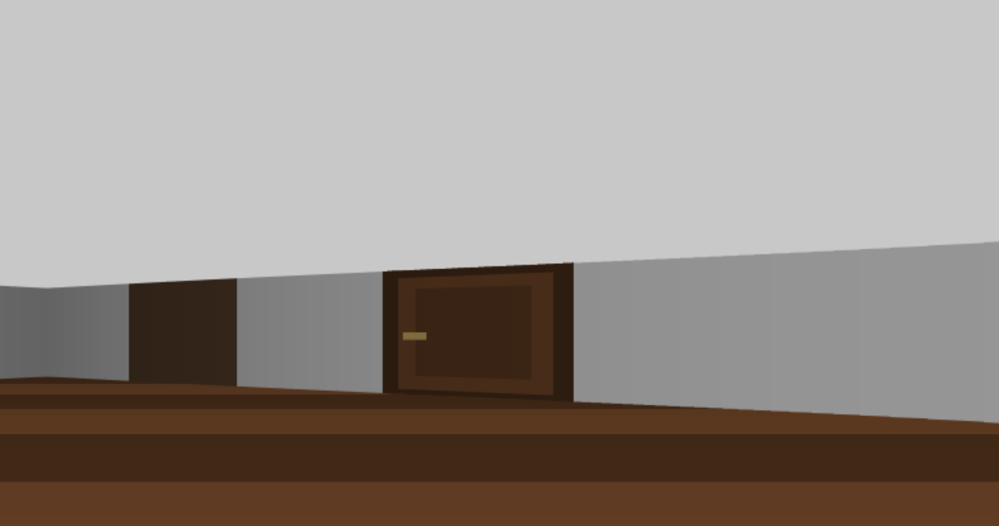
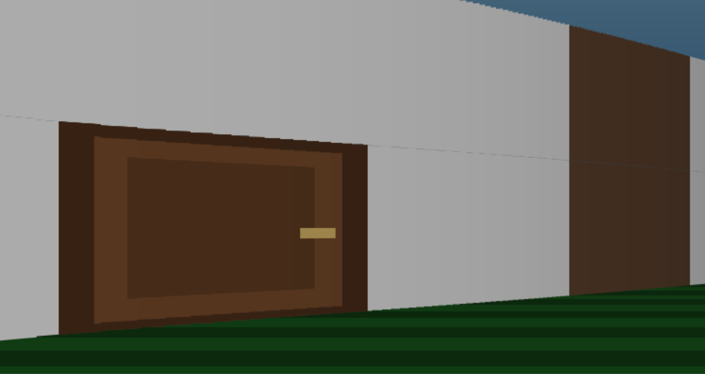
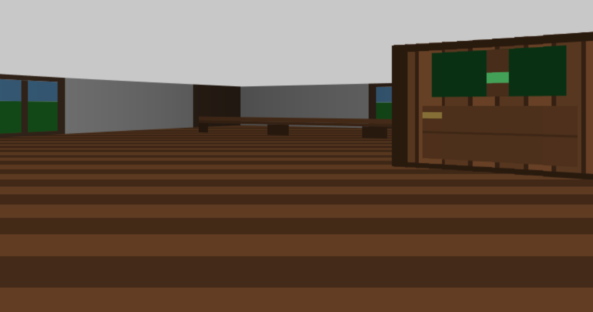

# DepthWalk

- 疑似3D探索ゲームのエンジン





---

## 概要

レイキャスティング技術を使用したブラウザベースの疑似3D探索ゲームエンジンです。
Canvas 2D APIを使用してリアルタイムレンダリングを行います。
TypeScriptで実装しました。


## 特徴

- **レイキャスティングによる3D描画**: Wolfenstein 3D風の疑似3Dグラフィックス
- **複数階層のサポート**: 1階・2階を階段で移動可能
- **室内/屋外の切り替え**: 建物の外に出ると空と芝生が表示される
- **様々なオブジェクト**: 壁、窓、ドア、ベンチなど
- **視点操作**: 上下の視点移動（ピッチ）に対応

## 操作方法

| キー | 操作 |
|------|------|
| W | 前進 |
| S | 後退 |
| A | 左回転 |
| D | 右回転 |
| ↑ | 視点を上へ |
| ↓ | 視点を下へ |

## 技術構成

```
src/engine/
├── main.ts       # ゲームループ
├── canvas.ts     # Canvas初期化
├── player.ts     # プレイヤー状態・移動処理
├── world.ts      # マップデータ・セルタイプ定義
├── raycaster.ts  # レイキャスティング処理
├── render.ts     # 床・天井の描画
├── textures.ts   # ドア・窓・家具のテクスチャ
├── colors.ts     # 色生成ユーティリティ
├── constants.ts  # 定数定義
└── input.ts      # キーボード入力
```

## セットアップ

```bash
npm install
npx tsc
```

ブラウザで `index.html` を開いてプレイできます。
